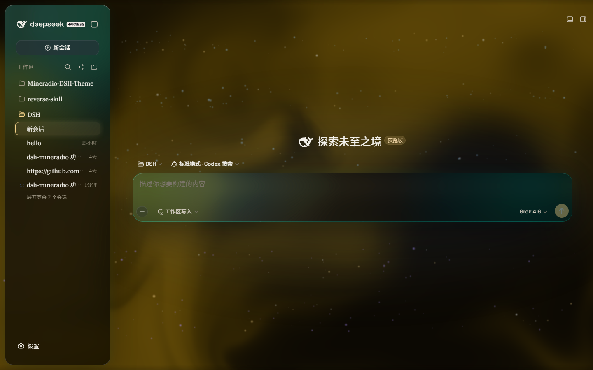
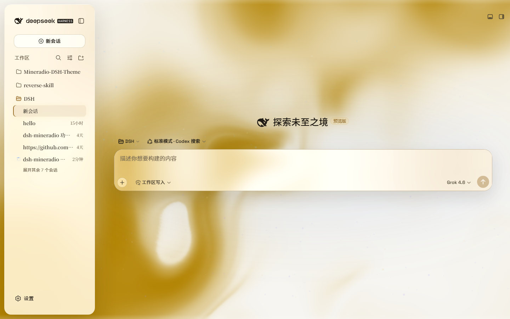
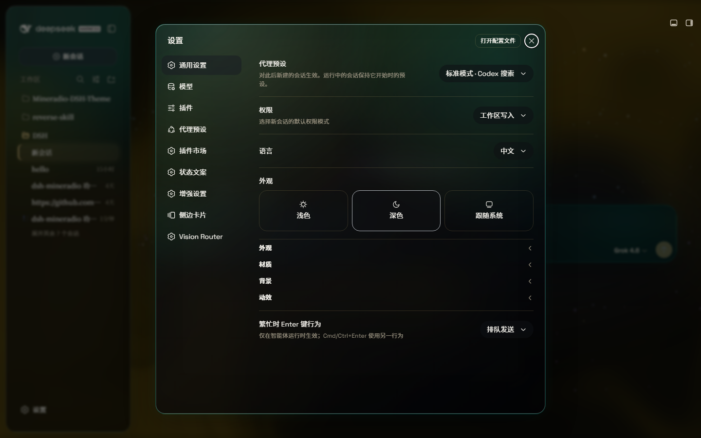

# dsh-theme-mineradio
[](https://awesome-dsh-plugin.com)

English | [中文](README.zh.md)

**Mineradio** is a cinematic glassmorphism theme for the DeepSeek Harness web UI — a faithful re-skin of the Mineradio "private visual radio" identity. The header, sidebar, composer, stats line, and trajectory view become panes of warm champagne glass over a near-black studio backdrop. You can put a video as wallpaper and switch it off and the stock UI comes back exactly, with no source changes to DSH itself.

<p align="center">
  
</p>

<p align="center"><em>Dark studio: teal glass over a champagne pour. The prompt floats in the liquid.</em></p>

## Screenshots

Live captures of 2.2.x on DeepSeek Harness — hero, paper-white, and the Looks panel (scenes / performance / mica):

| Dark studio | Light paper |
| --- | --- |
|  |  |

<p align="center">
  
</p>

<p align="center"><em>Looks: Studio / Deep sea / Midnight / Mist / Rainbow, plus Performance / Balanced / Vivid — one click, same glass family.</em></p>

A full-size gallery is also hosted at **https://dhicoc.github.io/dsh-theme-mineradio/**.

## What ports from Mineradio

- **Champagne-gold identity** — the signature palette (`#f4d28a` champagne, `#7ad7c2` mint, `#ff5367` ember rose over a warm near-black `#08090B`) drives every alias token: surfaces, hairline strokes, text ink, buttons, scrollbars, and warm-tinted shadows with a gold bloom.
- **Typography** — Inter + Noto Sans SC for the UI, self-hosted so there's no shell/fontsource dependency.
- **Cinematic glow** — a champagne-gold ambient bloom sits behind the glass; the spotlight hue knob sweeps it from warm amber to mint while keeping the brand warm.
- **Fluid backdrop** — a living fluid board (hue + depth adjustable, defaults to warm gold) or your own wallpaper (image or video) with its own blur and frost.

## Features

- **Two modes**: **Mica** restyles the layout into floating glass cards (blur and frost adjustable), while **Compatibility Mode** keeps the stock layout byte-for-byte and only swaps the material to generic glass — other plugins' UI gets the same treatment automatically
- **Free backdrop**: a living fluid board (hue adjustable) or your own wallpaper (fills the page, aspect preserved, with its own blur and frost); light wallpapers look best in light mode, dark wallpapers in dark mode
- **Background brightness**: follows the resolved scheme — dark mode darkens (0–50), light mode brightens (50–100), 50 is unchanged
- **Ambient decor**: particle whale in the chat center, star particles, and an interactive dot-grid mesh — all toggleable
- **Champagne glow**: a pointer-tracking glow over the glass panes, plus a hover press-down for tactile depth
- One switch: off restores the stock UI exactly, and every effect is removed with the plugin

### How coverage works (3.0)

Earlier versions decided what to style from class-name word roots, at a fixed specificity. Against the real 0.2.0-rc.2 shell that loses: the shell paints an opaque `--dsw-alias-bg-base` on its tab host, centre column and conversation column, and any host rule above that specificity wins outright — which is why patches kept missing areas. 3.0 covers surfaces three ways instead, in this order:

1. **Design tokens**, through the official `ctx.theme.overrideTokens()` seam. It writes inline custom properties on `body`, so it wins without `!important` and without a specificity contest. Measured against the rc.2 sources, 97% of painted backgrounds resolve to a token, so this one layer reaches nearly every surface — including into `::before`/`::after`, which inherit them.
2. **A runtime role census** for what tokens cannot express. It reads *computed paint and geometry* — never class names — and stamps `data-md-role` (`ground`, `structure`, `pane`, `overlay`, `control`, `chip`). The stylesheet then dresses by role with `!important`, so priority decides rather than a specificity race. It re-runs for elements added after mount, which is most of a React UI, and finishes in ~25 ms over 600 elements.
3. **Carve-outs that stay stock.** Code, terminals, form fields and file previews keep their own fill and get no blur; containers that *hold* code (program source, diff bodies, consoles) are carved out too, so the text behind them is not greyed. The host's positional anchors are never touched, because a `backdrop-filter` on them would re-anchor every in-place overlay. Faces that already wear the family rim are left alone, so hand-tuned panes keep their look.

A popover whose plate is drawn by a covering `::before` is detected and dressed on the *pseudo-element*, so the box stays clean instead of stacking a second layer of glass.

You can inspect it live: `__mineradioCensus()` reports how many faces carry each role, `__mineradioCensus(true)` re-runs the pass, and `__mineradioAudit()` sweeps for opaque surfaces the theme did not reach.

## Installation

### Windows (one command)

```powershell
powershell -ExecutionPolicy Bypass -Command "Invoke-WebRequest 'https://github.com/dhicoc/dsh-theme-mineradio/raw/main/install.ps1' -OutFile install.ps1; .\install.ps1"
```

Installs the **latest release** by default. No git needed — the installer falls back to a plain zip download. It links the plugin into the profile's `node_modules` and registers `ui-mineradio` in `cordis.patch.yml` (idempotent — safe to run again). Reload the web UI and it is on.

Pin a version or track the dev branch:

```powershell
.\install.ps1 -Version 'v1.0.0'   # a specific release
.\install.ps1 -Version 'main'     # the development branch
```

### Plugin market / npm (recommended)

```powershell
dsh plugin --profile web add dsh-theme-mineradio
```

Or search **dsh-theme-mineradio** in Settings → Plugin market. That installs the prebuilt npm package (`lib/` already bundled). There is **no** `prepare` / `postinstall` script.

From 2.3.6 the theme probes the host at load: it uses `@deepseek-ai/dsh-client-runtime` when present (DSH `0.1.1-rc.2+`) and falls back to `@deepseek-ai/dsh-client-store` (DSH Desktop 0.7.x / `0.1.2-alpha.1`). Do not pin 2.3.1 for old desktops and 2.3.5 for new ones — one latest build runs on both.

Do not install with `github:dhicoc/dsh-theme-mineradio` or `dsh plugin add https://github.com/dhicoc/dsh-theme-mineradio`. A git / tarball spec makes pnpm block "build scripts", and market updates then fail. If you already have the git spec, switch to npm:

```powershell
dsh plugin --profile web add dsh-theme-mineradio@latest
```

The `dsh.bundle` manifest registers `ui-mineradio` automatically, so no manual patch is needed. (The installer adds this equivalent entry for source installs:)

```yaml
- insert:
    - id: ui-mineradio
      name: 'dsh-theme-mineradio'
```

Restart the web UI. To turn it off: Settings → Plugins → **Mineradio**.

## License

MIT. Mineradio visual identity (palette, typography, glow aesthetic) is a faithful re-skin of the Mineradio project by XxHuberrr, whose original is licensed GPL-3.0.
