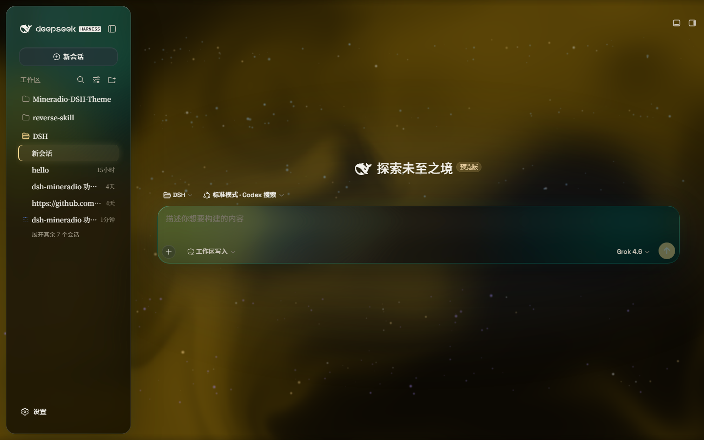
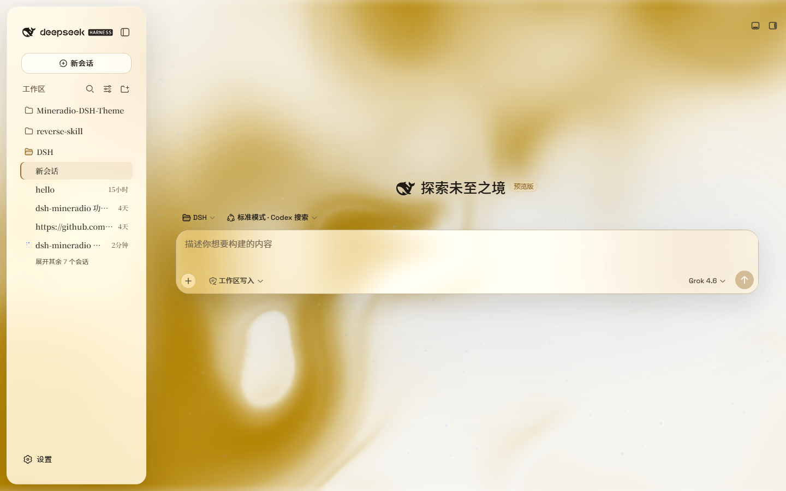
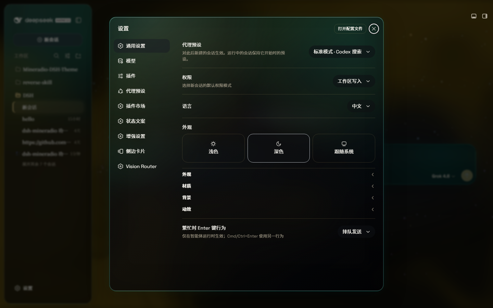

# dsh-theme-mineradio
[](https://awesome-dsh-plugin.com)

中文 | [English](README.md)

**Mineradio** 是一套为 DeepSeek Harness Web UI 打造的影院级玻璃拟态主题——对 Mineradio「私人视觉电台」气质的忠实移植。顶栏、侧栏、输入框、状态行与轨迹视图都化作近黑演播室背景上一块块温暖的香槟金玻璃。你可以把视频设为壁纸，一键关闭后原样还原官方界面，无需改动 DSH 任何源码。

## 截图

主题在 DeepSeek Harness UI 上的实机截图——深色、浅色与设置面板：

| 深色 | 浅色 |
| --- | --- |
|  |  |



原图相册也托管在 **https://dhicoc.github.io/dsh-theme-mineradio/**。

## 从 Mineradio 移植了什么

- **香槟金身份标识** —— 招牌调色板（香槟金 `#f4d28a`、薄荷 `#7ad7c2`、余烬玫瑰 `#ff5367`，压在一层温暖的近黑 `#08090B` 之上）驱动全部 alias token：表面、发丝描边、文字墨色、按钮、滚动条，以及带金色辉光的暖调阴影。
- **字体** —— 界面使用 Inter + Noto Sans SC，自托管，不依赖外壳或 fontsource。
- **影院辉光** —— 玻璃背后有一层香槟金环境光；辉光色相旋钮可把它从暖琥珀扫到薄荷，同时保持品牌暖调。
- **流体背景** —— 流动流体板（色相 + 深浅可调，默认落在暖金色），或自选壁纸（图片 / 视频），各自带模糊与磨砂。

## 特性

- **双模式**：**云母效果**把布局重构为漂浮的玻璃卡片（模糊度、磨砂度可调）；**兼容模式**按字节保留官方布局，只把材质换成通用玻璃——其他插件的 UI 也会自动获得同样的玻璃质感
- **自由背景**：流动流体板（色相可调）或自选壁纸（铺满页面、保持比例，带独立模糊与磨砂）；浅色壁纸配浅色模式观感最佳，深色壁纸配深色模式
- **背景亮度**：跟随解析到的配色——深色模式压暗（0–50），浅色模式提亮（50–100），50 为原样
- **环境装饰**：聊天区中心的粒子鲸鱼、星尘粒子、可交互点阵网格——都可开关
- **香槟辉光**：跟随鼠标在玻璃面板上流动的光晕，外加悬停下压的触觉深度
- 一个开关：关闭后原样还原官方界面，插件卸载时所有效果一并移除

## 安装

### Windows（一条命令）

```powershell
powershell -ExecutionPolicy Bypass -Command "Invoke-WebRequest 'https://github.com/dhicoc/dsh-theme-mineradio/raw/main/install.ps1' -OutFile install.ps1; .\install.ps1"
```

默认安装**最新正式版**。无需 git——安装脚本会退回到普通 zip 下载。脚本会把插件链接进 profile 的 `node_modules`，并在 `cordis.patch.yml` 中注册 `ui-mineradio`（幂等，可重复执行）。刷新 Web UI 即为开启状态。

锁定版本或跟踪开发分支：

```powershell
.\install.ps1 -Version 'v1.0.0'   # 指定版本
.\install.ps1 -Version 'main'     # 开发分支
```

### 插件市场 / npm（推荐）

```powershell
dsh plugin --profile web add dsh-theme-mineradio
```

或在设置 → 插件市场搜索 **dsh-theme-mineradio**。装的是 npm 上的预构建包（`lib/` 已打好），**没有** `prepare` / `postinstall`。

不要写成 `github:dhicoc/dsh-theme-mineradio` 或 `dsh plugin add https://github.com/dhicoc/dsh-theme-mineradio`。git / tarball 源会让 pnpm 拦「构建脚本」，市场更新也会失败。已经是 git 源的，改成 npm 即可：

```powershell
dsh plugin --profile web add dsh-theme-mineradio@latest
```

`dsh.bundle` manifest 会自动注册 `ui-mineradio`，无需手动补丁。（安装脚本对源码安装会写入这条等价条目：）

```yaml
- insert:
    - id: ui-mineradio
      name: 'dsh-theme-mineradio'
```

重启 Web UI。想要关闭：设置 → 插件 → **Mineradio**。

## 许可证

MIT。Mineradio 视觉标识（调色板、字体、辉光美学）是对 XxHuberrr 的 Mineradio 项目的忠实重新定制，原项目采用 GPL-3.0 授权。
